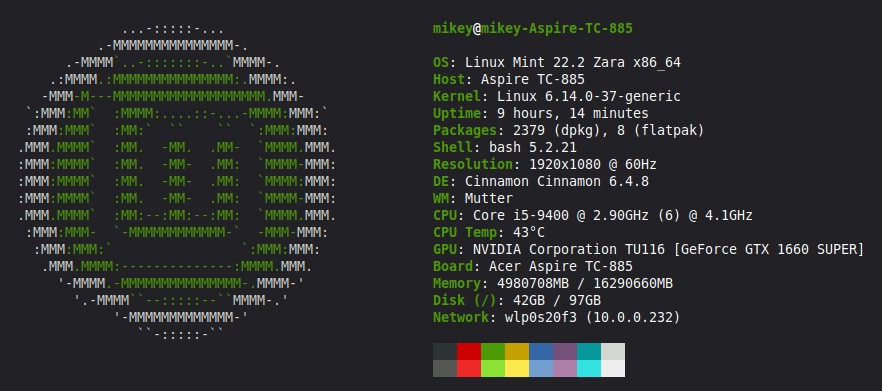

<h2 align="center">Freshfetch</h2>
<p align="center">
<i>A fresh take on Neofetch</i>
<br>
<br>
<a href="./LICENSE.md"></a>
<a href="https://github.com/nordicnode/freshfetch/releases"></a>
</p>

A fast, customizable system information tool written in Rust. This is a continuation of the original [freshfetch](https://github.com/K4rakara/freshfetch) by K4rakara.

<p align="center">
  
</p>

## What's New in This Fork

This version has been extensively modernized with significant improvements:

| Category | Changes |
|----------|---------|
| **New Modules** | Battery status, Disk usage, Network info |
| **Output** | JSON output via `--json` flag |
| **Performance** | Parallel info gathering with `rayon` |
| **Shell Detection** | Version support for Bash, Zsh, Fish, Nushell |
| **GPU Detection** | Fixed NVIDIA card detection |
| **Error Handling** | Complete refactor to `Result`-based propagation (no panics) |
| **Code Quality** | 99 clippy warnings → 1 |
| **Dependencies** | `mlua` 0.9.9, `sysinfo` 0.30, `clap` 4.x, `serde` 1.0, `serde_json` 1.0 |
| **Portability** | Removed hardcoded paths, pure Rust distro detection, Android motherboard support |
| **Colorization** | Full ANSI support for all 120+ distributions |
| **ASCII Art** | O(1) lookup via LazyLock HashMap (270+ entries indexed) |
| **Internal** | Refactored JSON output to use Serde-based serialization |
| **Testing** | Initial unit test suite for core parsing logic |

## Installation

```bash
git clone https://github.com/nordicnode/freshfetch.git
cd freshfetch
cargo build --release
sudo cp ./target/release/freshfetch /usr/bin/
```

## Usage

```bash
freshfetch                  # Display system info with ASCII art
freshfetch --logo           # Display only ASCII art
freshfetch -a ubuntu        # Use Ubuntu's ASCII art
freshfetch --json           # Output as machine-readable JSON
```

## System Information

Displays: User, Host, OS, Kernel, Uptime, Packages, Shell, Resolution, DE, WM, CPU, GPU, Board, Memory, Battery, Disk, Network

## Customization

Create custom layouts in `~/.config/freshfetch/`:
- `layout.lua` - Main layout
- `info.lua` - System information display
- `art.lua` - Custom ASCII art

Supports image display via Kitty, Sixel, and iTerm2 protocols.

## Requirements

- Rust 2021 Edition (1.56+)
- Linux, BSD, or MINIX

## Todo

- [x] Unit tests
- [ ] macOS support


